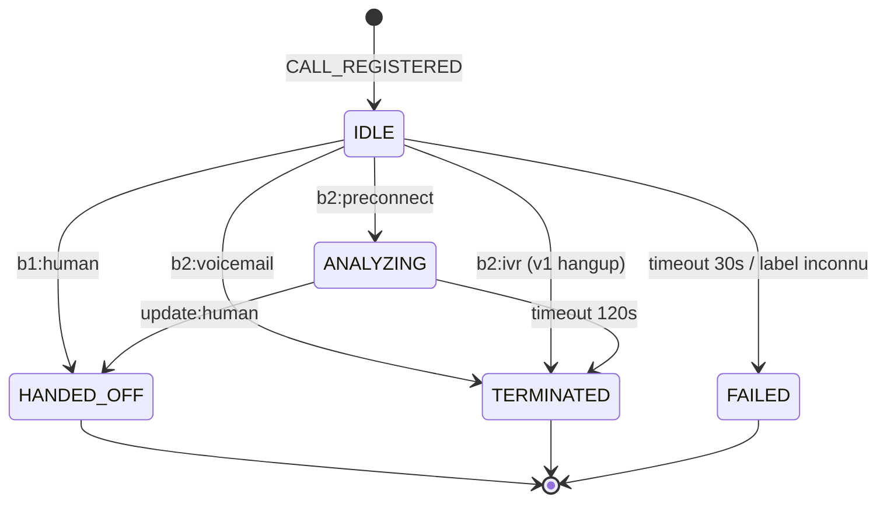

# Orchestrateur AMD — architecture v1 (scaffold)

> Version : v1 — scaffold exécutable, **pas** un livrable de production.

---

## 1. Contexte et périmètre

### 1.1 Ce qu'on construit

Un service HTTP appelé **orchestrateur AMD** qui s'insère entre :

- le système téléphonique (OpenSIPS / FreeSWITCH en prod, simulateur RTP en test),
- l'AMD (déjà existant, maîtrisé, port 5009),
- le bot conversationnel (existant mais inconnu au niveau intégration).

Rôle : **transformer les callbacks de décision émis par l'AMD en actions concrètes** (raccrocher, passer l'appel au bot, etc.), pilotées par une machine à états finis (FSM).

### 1.2 Ce que la v1 fait

- Expose les endpoints HTTP nécessaires pour recevoir `register_call` et les `callback` de l'AMD.
- Implémente la FSM complète : 5 états, toutes les transitions, tous les cas d'erreur.
- Déclenche les actions (`HANDOFF_TO_BOT`, `HANGUP`) sous forme de **stubs loggés** avec TODO explicites.
- Trace chaque appel de bout en bout dans les logs.
- Se branche au simulateur RTP existant sans modifier l'AMD.

### 1.3 Ce que la v1 ne fait pas

- Aucun dialogue réel avec le bot.
- Aucune action SIP réelle (raccrochage, transfert, bridge media).
- Aucune navigation IVR (DTMF).
- Aucun ASR secondaire.
- Aucune métrique / confusion matrix. Juste des logs structurés.

### 1.4 Principe directeur

**L'orchestrateur vit uniquement dans le plan de contrôle.** Il ne reçoit jamais de RTP. Il ne touche jamais aux paquets audio. Il reçoit des décisions HTTP et émet des ordres HTTP (stubés en v1).

Conséquence : la FSM livrée ici est **définitive**. Ce qui bougera dans les versions suivantes, c'est uniquement l'implémentation des stubs d'actions, pas la logique de la FSM.

---

## 2. Vue d'ensemble

```
┌──────────────────────┐
│  Simulateur RTP      │   (ou OpenSIPS en prod)
│  (port local)        │
└────────┬─────────────┘
         │
         │ 1. POST /register_call
         │    (call_id, rtp_port,
         │     callback_url, called_number)
         │
         ├──────────────────────────────────────┐
         │                                      │
         ▼                                      ▼
┌──────────────────────┐              ┌──────────────────────┐
│  AMD (existant)      │              │  Orchestrateur       │
│  port 5009           │              │  port 5010           │
│                      │              │                      │
│  reçoit RTP + decide │              │  reçoit register     │
│  envoie callbacks    │◄─ RTP ─┐     │  → FSM en IDLE       │
└────────┬─────────────┘        │     └──────────────────────┘
         │                      │                │
         │ 2. POST /callback    │                │
         │    (stage, label,    │                │
         │     confidence...)   │                │
         │                      │                ▼
         └──────────────────────┴──────► ┌────────────────────┐
                                         │  FSM : transition  │
                                         │  Action : stub log │
                                         └────────────────────┘
```

**Note sur le double `register_call` :** en test, le simulateur envoie `register_call` à l'AMD uniquement (comportement actuel). Pour la v1 on modifiera le simulateur pour qu'il l'envoie aussi à l'orchestrateur. Alternative : le simulateur l'envoie à l'orchestrateur, qui le forwarde à l'AMD. Choix final à trancher lors de l'écriture du scaffold.

---

## 3. Composants de l'orchestrateur

L'orchestrateur est un service Python/FastAPI structuré en modules isolés.

Deux catégories :
- **À figer** = ne pas toucher une fois validé. Si on modifie ça, toute la logique en aval bouge.
- **Modifiable** = peut évoluer sans casser la FSM. Forme actuelle suffisante pour v1, peut gagner des champs / endpoints en v2+.

| Module | Rôle | Catégorie |
|--------|------|-----------|
| `fsm.py` | Définition des états, transitions, guards | **À figer** |
| `handlers.py` | Fonction de dispatch `(état, événement) → nouvel état + action` | **À figer** |
| `actions.py` | Stubs `HANDOFF_TO_BOT`, `HANGUP` — à remplacer par les équipes | Modifiable |
| `api.py` | Endpoints HTTP (FastAPI) | Modifiable |
| `models.py` | Dataclasses (CallContext, CallbackPayload) | Modifiable |
| `config.py` | Constantes configurables (timeouts) | Modifiable |
| `logging_setup.py` | Format de logs structurés | Modifiable |
| `tests/` | Tests unitaires de la FSM | Modifiable |

---

## 4. Interfaces HTTP

### 4.1 `POST /register_call`

Appelé en début d'appel. Crée un `CallContext` en état `IDLE` et arme le timer de timeout.

**Payload attendu (identique à celui de l'AMD) :**
```json
{
  "call_id": "sim_123_45678",
  "rtp_port": 20000,
  "callback_url": "http://...",
  "called_number": "0600000000"
}
```

**Réponse :**
```json
{ "status": "ok", "call_id": "sim_123_45678" }
```

**Notes :**
- `rtp_port`, `callback_url`, `called_number` sont stockés dans le `CallContext` mais **pas utilisés par la FSM en v1**. Ils sont loggés pour traçage et seront utiles plus tard (actions SIP).
- Si le `call_id` existe déjà → on ignore, on log un warning.

### 4.2 `POST /callback`

Appelé par l'AMD à chaque décision. Déclenche une transition de FSM.

**Payload attendu (copié du simulateur, voir `handle_callback` du `rtp_simulator_v2.py`) :**
```json
{
  "call_id": "sim_123_45678",
  "stage": "b1" | "b2" | "b2_whisper" | "update",
  "decision_label": "human" | "machine" | "voicemail" | "preconnect" | "ivr",
  "confidence": 0.92,
  "latency_ms": 2450,
  "window": "2.5s",
  "monitoring_active": true | false,
  "...": "autres champs selon le stage"
}
```

**Mapping stage → label consommé par la FSM :**

| `stage` reçu | Champ lu | Traité comme |
|--------------|----------|--------------|
| `b1` | `decision_label` | `HUMAN` ou `MACHINE` (mais MACHINE n'est jamais final, on attend b2) |
| `b2` | `decision_label` | `HANGUP` (voicemail), `PRECONNECT`, `IVR` |
| `b2_whisper` | `decision_label` | idem b2 (override) |
| `update` | `decision_label` | `HUMAN` (transition post-preconnect) |

**Réponse :**
```json
{ "status": "ok" }
```

### 4.3 `GET /health`

Simple healthcheck.

### 4.4 `GET /calls` (debug)

Retourne la liste des appels actifs et leur état FSM courant. Utile pour le debug manuel.

---

## 5. Machine à états (figée)

### 5.1 États

| État | Signification | Final ? |
|------|---------------|---------|
| `IDLE` | Appel enregistré, on attend le premier callback AMD | Non |
| `ANALYZING` | PRECONNECT reçu, on attend UPDATE:HUMAN ou timeout | Non |
| `HANDED_OFF` | Action HANDOFF_TO_BOT déclenchée | **Oui** |
| `TERMINATED` | Action HANGUP déclenchée (décision normale) | **Oui** |
| `FAILED` | Erreur / timeout / label inconnu | **Oui** |

### 5.2 Événements d'entrée

| Événement | Source | Produit par |
|-----------|--------|-------------|
| `CALL_REGISTERED` | POST /register_call | Simulateur / OpenSIPS |
| `AMD_CALLBACK(stage, label)` | POST /callback | AMD |
| `TIMEOUT_IDLE` | Timer interne (30s) | Orchestrateur |
| `TIMEOUT_ANALYZING` | Timer interne (120s) | Orchestrateur |

### 5.3 Actions de sortie (abstraites)

| Action | Sens métier | Implémentation v1 |
|--------|-------------|-------------------|
| `HANDOFF_TO_BOT(call_id, ctx)` | "Passe cet appel au bot" | Log + TODO bot |
| `HANGUP(call_id, reason)` | "Raccroche cet appel" | Log + TODO SIP |

### 5.4 Table de transitions (exhaustive)

| # | État courant | Événement | Condition | Nouvel état | Action |
|---|--------------|-----------|-----------|-------------|--------|
| T1 | — | `CALL_REGISTERED` | — | `IDLE` | Armer timer IDLE (30s) |
| T2 | `IDLE` | `AMD_CALLBACK` | `stage=b1` (tout label) | `HANDED_OFF` | `HANDOFF_TO_BOT` |
| T3 | `IDLE` | `AMD_CALLBACK` | `stage=b2` ou `b2_whisper`, `label=voicemail` | `TERMINATED` | `HANGUP(reason=voicemail)` |
| T4 | `IDLE` | `AMD_CALLBACK` | `stage=b2`, `label=ivr` | `TERMINATED` | `HANGUP(reason=ivr_v1)` |
| T5 | `IDLE` | `AMD_CALLBACK` | `stage=b2`, `label=preconnect`, `monitoring_active=true` | `ANALYZING` | Armer timer ANALYZING (120s) |
| T7 | `ANALYZING` | `AMD_CALLBACK` | `stage=update, label=human` | `HANDED_OFF` | `HANDOFF_TO_BOT` |
| T8 | `ANALYZING` | `TIMEOUT_ANALYZING` | — | `TERMINATED` | `HANGUP(reason=timeout_analyzing)` |
| T9 | `IDLE` | `TIMEOUT_IDLE` | — | `FAILED` | `HANGUP(reason=no_callback)` |
| T10 | `HANDED_OFF` / `TERMINATED` / `FAILED` | n'importe quoi | — | inchangé | ignorer + log warning |
| T11 | tout sauf état final | `AMD_CALLBACK` | `stage` ou `label` inconnu | `FAILED` | `HANGUP(reason=unknown_label)` + log error |

**Note sur T2 (unification des callbacks `stage=b1`) :**

L'orchestrateur traite **tous** les callbacks `stage=b1` comme `HANDOFF_TO_BOT`, quel que soit le `decision_label`.

Raisons :
1. **Comportement actuel de l'AMD** (vérifié dans `amd_receiver_whisper_b2_cascade_udp.py`, lignes 977-994 et 513-520) :
   - `b1=human` → callback envoyé toujours.
   - `b1=machine` → pas de callback en prod normale, SAUF cas edge de la final window argmax=machine.
2. **Correctif AMD prévu** : la cascade B1 déclenchera B2 même en cas d'argmax=machine à la final window. Après ce correctif, seul `b1=human` arrivera jamais à l'orchestrateur.
3. **Aucun code mort après correctif** : la règle "tout `stage=b1` → HANDOFF_TO_BOT" reste valide que le correctif soit déployé ou non.

Côté orchestrateur, aucune modification à prévoir quand le correctif AMD arrivera.

### 5.5 Diagramme



---

## 6. Pseudo-code de la fonction de dispatch centrale

C'est le cœur de l'orchestrateur. Tout ce qui est au-dessus (HTTP, logs) et en dessous (actions) tourne autour.

```python
# handlers.py (pseudo-code)

def handle_event(ctx: CallContext, event: Event) -> Transition:
    """
    Fonction pure (hors I/O) qui calcule la prochaine transition.
    Retourne (nouvel_état, action_à_déclencher, raison).
    Ne déclenche RIEN elle-même — c'est le caller qui exécute l'action.
    """

    # Règle T10 : états finaux absorbants
    if ctx.state in (HANDED_OFF, TERMINATED, FAILED):
        log.warning("event ignored, already in final state", ctx=ctx, event=event)
        return Transition(ctx.state, action=None)

    # Règle T1 : enregistrement
    if event.type == CALL_REGISTERED:
        return Transition(IDLE, action=ARM_TIMER_IDLE)

    # Règles T9, T8 : timeouts
    if event.type == TIMEOUT_IDLE and ctx.state == IDLE:
        return Transition(FAILED, action=HANGUP, reason="no_callback")
    if event.type == TIMEOUT_ANALYZING and ctx.state == ANALYZING:
        return Transition(TERMINATED, action=HANGUP, reason="timeout_analyzing")

    # Règles T2–T7 : callbacks AMD
    if event.type == AMD_CALLBACK:
        label = extract_label(event.payload)  # stage + decision_label → label canonique

        # Depuis IDLE
        if ctx.state == IDLE:
            # T2 : tout callback stage=b1 va vers le bot
            if event.payload.stage == "b1":
                return Transition(HANDED_OFF, HANDOFF_TO_BOT)
            # T3–T5 : callbacks b2 / b2_whisper
            if label == VOICEMAIL:    return Transition(TERMINATED, HANGUP, "voicemail")
            if label == IVR:          return Transition(TERMINATED, HANGUP, "ivr_v1")
            if label == PRECONNECT:   return Transition(ANALYZING, ARM_TIMER_ANALYZING)
            # Règle T11 : stage ou label inconnu
            return Transition(FAILED, HANGUP, "unknown_label")

        # Depuis ANALYZING
        if ctx.state == ANALYZING:
            if label == HUMAN:  # update:human
                return Transition(HANDED_OFF, HANDOFF_TO_BOT)
            # Autre callback reçu pendant ANALYZING → on reste (ou on bascule si besoin)
            # TODO : à préciser si l'AMD peut envoyer un b2 à nouveau pendant ANALYZING
            return Transition(ANALYZING, action=None)

    # Garde-fou
    return Transition(FAILED, HANGUP, "unhandled_event")


# api.py (pseudo-code du handler HTTP)

@app.post("/callback")
async def on_callback(payload: CallbackPayload):
    ctx = store.get(payload.call_id)
    if ctx is None:
        log.warning("callback for unknown call_id", call_id=payload.call_id)
        return {"status": "ok"}  # on ne crash pas l'AMD pour autant

    event = Event(type=AMD_CALLBACK, payload=payload)
    transition = handle_event(ctx, event)

    # Appliquer la transition
    ctx.state = transition.new_state
    if transition.action is not None:
        await execute_action(transition.action, ctx, transition.reason)

    store.save(ctx)
    return {"status": "ok"}
```

**Point clé :** `handle_event` est une **fonction pure**. Ça la rend trivialement testable sans avoir besoin de mocker HTTP, timers, etc. Les tests unitaires de la FSM sont juste une liste d'assertions `assert handle_event(ctx_A, event_X) == Transition(state_B, action_Y)`.

---

## 7. Extension points (TODO explicites)

Voilà les endroits où les autres équipes viendront remplir leurs morceaux. Chaque TODO est une fonction à implémenter, avec un contrat d'entrée/sortie clair.

### 7.1 `actions.handoff_to_bot(call_id, context) -> Awaitable[bool]`

```python
async def handoff_to_bot(call_id: str, ctx: CallContext) -> bool:
    """
    Passe l'appel au bot conversationnel.

    En v1 : juste un log.

    TODO bot :
      Implémenter l'intégration avec le bot existant.
      Questions ouvertes à clarifier :
      - Par quel mécanisme activer le bot ? HTTP REST ? Websocket ?
        Event sur un bus (Kafka, Redis pub/sub, etc) ?
      - Quelles informations attend le bot ? Juste call_id ? Ou aussi
        called_number, session metadata, contexte appelant ?
      - Le bot confirme-t-il qu'il a pris la main (réponse synchrone) ou
        est-ce du fire-and-forget ?
      - Que fait-on si le bot ne répond pas / est down ?
        Fallback HANGUP ? Retry ?
    """
    log.info("ACTION: HANDOFF_TO_BOT", call_id=call_id, ctx=ctx.to_dict())
    return True  # stub
```

### 7.2 `actions.hangup(call_id, reason) -> Awaitable[bool]`

```python
async def hangup(call_id: str, reason: str) -> bool:
    """
    Raccroche l'appel.

    En v1 : juste un log.

    TODO SIP :
      Implémenter la commande de raccrochage effective.
      Questions ouvertes à clarifier :
      - Quel protocole de contrôle utilisez-vous côté OpenSIPS / FS ?
        - OpenSIPS MI (datagram, fifo, http) ?
        - FreeSWITCH ESL ?
        - Une API interne HTTP dédiée ?
      - Quel identifiant permet de retrouver l'appel côté SIP ?
        call_id suffit, ou faut-il un dialog_id / uuid FS ?
      - Est-ce qu'on doit passer un motif / SIP cause code ?
        (ex: 486 Busy, 480 Temporarily Unavailable, 200 OK + BYE)
      - Raccrochage synchrone ou asynchrone ?
    """
    log.info("ACTION: HANGUP", call_id=call_id, reason=reason)
    return True  # stub
```

### 7.3 Autres TODO disséminés

- **`config.TIMEOUT_IDLE_NO_CALLBACK_S`** : actuellement 30s. À confirmer avec SIP.
- **`config.TIMEOUT_ANALYZING_S`** : actuellement 120s. À confirmer avec SIP.
- **Cas `IVR` en v1 = HANGUP.** TODO v3 : implémenter un état `NAVIGATING_IVR` avec ASR + DTMF.
- **Deuxième callback b2 pendant ANALYZING** : comportement actuel = ignorer. 

---

## 8. Tester avec le simulateur existant

### 8.1 Setup

Deux services tournent en parallèle sur la machine de dev :

| Service | Port | Commande |
|---------|------|----------|
| AMD | 5009 | identique à aujourd'hui |
| Orchestrateur | 5010 | `python -m orchestrator.main` (à écrire) |

### 8.2 Modification du simulateur

**Une seule ligne à changer** : le `callback_url` passé dans `register_call` doit pointer vers l'orchestrateur (port 5010) au lieu du callback server interne du simulateur (port 8765).

Option propre : ajouter un flag `--orchestrator-url` au simulateur. Par défaut il continue d'utiliser son callback server interne (pour comparaison avec l'AMD seul). Avec le flag, il route les callbacks vers l'orchestrateur.

### 8.3 Ce qu'on voit en logs

Pour un appel HUMAIN, trace attendue :

```
[sim_123] /register_call received
[sim_123] FSM transition: <init> → IDLE (armed timer 30s)
[sim_123] /callback received (stage=b1, label=human)
[sim_123] FSM transition: IDLE → HANDED_OFF (action=HANDOFF_TO_BOT)
[sim_123] ACTION: HANDOFF_TO_BOT (stub, TODO équipe bot)
```

Pour un appel VOICEMAIL :
```
[sim_456] /register_call received
[sim_456] FSM transition: <init> → IDLE
[sim_456] /callback received (stage=b2, label=voicemail)
[sim_456] FSM transition: IDLE → TERMINATED (action=HANGUP, reason=voicemail)
[sim_456] ACTION: HANGUP (stub, TODO équipe SIP)
```

Pour un appel IVR :
```
[sim_999] /register_call received
[sim_999] FSM transition: <init> → IDLE
[sim_999] /callback received (stage=b2, label=ivr)
[sim_999] FSM transition: IDLE → TERMINATED (action=HANGUP, reason=ivr_v1)
[sim_999] ACTION: HANGUP (stub, TODO équipe SIP)
[sim_999] TODO v3: navigation IVR (ASR + DTMF + keywords / LLM)
```

Pour un appel PRECONNECT → HUMAN :
```
[sim_789] /register_call received
[sim_789] FSM transition: <init> → IDLE
[sim_789] /callback received (stage=b2, label=preconnect, monitoring_active=true)
[sim_789] FSM transition: IDLE → ANALYZING (armed timer 120s)
[sim_789] /callback received (stage=update, label=human)
[sim_789] FSM transition: ANALYZING → HANDED_OFF (action=HANDOFF_TO_BOT)
[sim_789] ACTION: HANDOFF_TO_BOT (stub, TODO équipe bot)
```

---

## 9. Questions ouvertes (hors v1)

Questions à poser plus tard, quand la v1 tournera :

**Pour SIP :**
- Topologie RTP en prod : SIPREC, port mirror, fork média ?
- Mécanisme de contrôle (MI/ESL/autre) pour HANGUP et BRIDGE ?
- Durée max d'un appel sortant côté opérateur ?
- `register_call` envoyé par OpenSIPS à deux destinataires (AMD + orchestrateur) ou forward par orchestrateur ?

**Pour le bot :**
- Stack du bot ? Comment on active "le bot parle" ?
- Format de l'information à passer ?
- Gestion barge-in (bot coupé si humain parle) ?

**Pour AMD  :**
- ~~Liste exhaustive des `stage × decision_label` possibles.~~ → Couverte (b1:human, b2:voicemail/preconnect/ivr, b2_whisper:voicemail, update:human, edge case b1:machine).
- ~~Peut-il y avoir plusieurs callbacks `b2` successifs pour un même appel ?~~ → Le simulateur gère déjà ce cas, comportement côté orchestrateur à confirmer (actuellement : en `ANALYZING`, un second b2 est ignoré).
- **Comportement si l'appel est raccroché avant décision** → Géré implicitement par le timer IDLE (30s → FAILED → HANGUP stubé, no-op puisque l'appel est déjà mort côté SIP). Note : on pourrait plus tard ajouter un endpoint `POST /call_ended/{call_id}` que le SIP appellerait pour libérer les ressources plus vite, mais **hors scope v1**.

---

## 10. Prochaines étapes

1. **Valider ce document.** Figé sur la FSM. Ajustements possibles sur les sections 4, 7, 8.
2. **Écrire le scaffold** : arborescence du repo, FastAPI + FSM + stubs + tests + README. *(Prochain tour de conversation.)*
3. **Brancher le simulateur** sur l'orchestrateur et vérifier les logs.
4. **Partager le repo** avec les équipes SIP et bot, qui viendront remplir les TODO.
